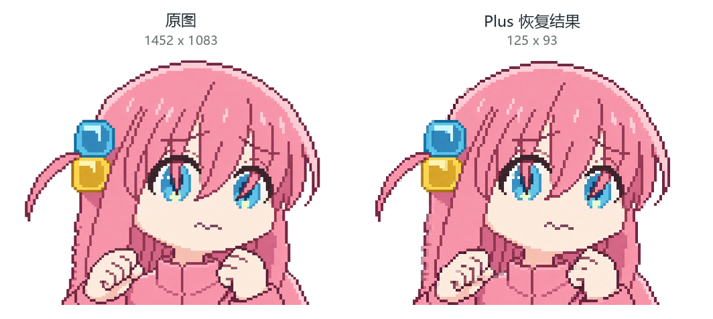
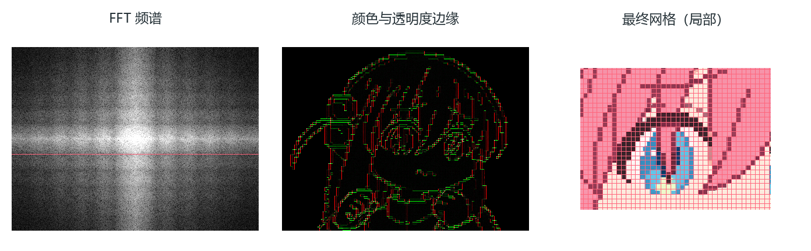
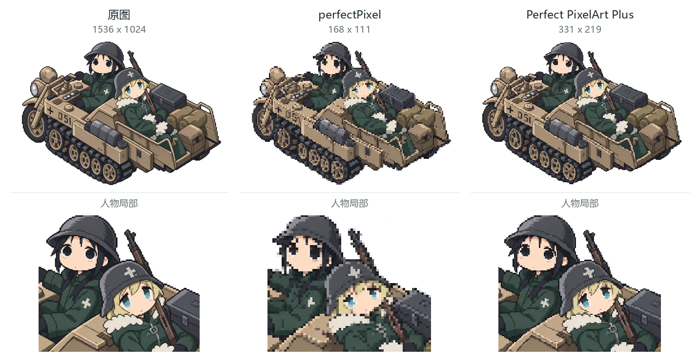

# Perfect PixelArt Plus


## 简介

将 AI 生成的“伪像素画”整理为网格规整的低分辨率 PNG，也支持将普通照片、插画像素化。支持透明背景，图片在本机处理。

**[打开网页版](https://perfectpixelart.github.io/)** · **[下载桌面版](https://github.com/Sixiang-Wang/perfect_pixel_art/releases)**



左：原图；右：恢复结果。两张图按相同大小展示，右图实际只有 **125×93** 像素。

## 下载与安装

网页版打开即可使用。桌面版在 [Releases](https://github.com/Sixiang-Wang/perfect_pixel_art/releases) 的 **Assets** 中下载，无需安装 Python。

| 系统 | 下载文件 | 打开方式 |
| --- | --- | --- |
| Windows 64 位 | `Perfect-PixelArt-Plus-版本号-win-x64.exe` | 双击运行，免安装 |
| Mac，Apple 芯片（M 系列） | `Perfect-PixelArt-Plus-版本号-mac-arm64.dmg` | 打开后拖入“应用程序” |
| Mac，Intel 芯片 | `Perfect-PixelArt-Plus-版本号-mac-x64.dmg` | 打开后拖入“应用程序” |

Mac 版需要 macOS 13 或更新版本。桌面版可离线使用；Windows 首次启动需要展开运行文件，后续会复用缓存。

## 使用

网页版和桌面版操作相同，可以先用 [lastTour 原图](input/lastTour.png) 试一下。

1. **放入图片**：点击“上传图片”或原图窗口，也可以直接拖入文件。
2. **点击“生成”**：先使用默认设置，程序会自动判断格子大小并恢复像素。
3. **按需调整颜色**：默认不限制颜色；也可限制数量，或选择 DMC、MARD 色库。“自然”按人眼感知色差匹配，“RGB”按 RGB 数值距离匹配。颜色调整在恢复之后进行，不会重新划分网格。
4. **下载 PNG**：导出倍数设为 **1**，保存原生低分辨率图片；设为 **2–16**，使用最近邻放大，无需重新生成。


滚轮或图片右上角的加减号可以缩放预览，按住鼠标左键可拖动图片。“更多设置”中的“生成处理过程”默认开启，可查看并下载 FFT、边缘、网格等诊断图。

<details>
<summary>使用 Python 命令行</summary>

安装 Python 3.10 或更新版本，下载源码后，在项目根目录执行：

```bash
python -m pip install -e .
python pixelperfect.py -i input/lastTour.png
```

结果保存为 `output/lastTour.png`。默认只生成结果图；加上 `--debug` 后，处理过程保存到 `output/debug/lastTour/`。

```bash
python pixelperfect.py -i input/lastTour.png --colors 32 --scale 4 --debug
```

上例限制为最多 32 色，并将结果放大 4 倍。使用 `--help` 查看全部参数。算法运行依赖只有 NumPy 和 Pillow。

</details>

## 算法

处理分为四步，网页与桌面版共用同一套 Python 核心：

1. **找边缘**：分别计算横纵方向的颜色与透明度变化，完全透明像素的隐藏 RGB 不参与颜色判断。
2. **找网格**：结合 FFT 的周期线索和边缘间距提出候选，同时比较半倍、两倍间距，搜索网格起点，并做小范围局部校正。FFT 不直接决定最终格距。
3. **检查网格**：检查边缘与格线是否吻合；对部分较弱候选，辅以水平／垂直连续边段验证，并保护已有的原生单像素细节。
4. **恢复颜色**：每格采用中心优先的稳健取色，结合邻近样本检查异常点，保留透明度。限色和色库匹配在这一步之后单独执行。



上图来自 bocchi2 的实际处理过程：左为 FFT 频谱，中间红、绿分别表示 X、Y 方向的边缘，右侧红线是最终格子边界的局部放大。

没有可靠网格时，默认尝试估算格距或按保守尺寸像素化；已有的原生像素图会尽量保留。严重模糊、重复纹理和不规则格子仍可能误判，界面中的置信分数是启发式指标，不是正确概率。

------

感谢 [theamusing/perfectPixel](https://github.com/theamusing/perfectPixel)。它用 FFT 估计格距、用边缘校正网格再取色的思路，启发了本项目。

Plus 主要围绕这些环节做了改进：

- **格距选择**：比较多个尺度与起点，加入边缘间距和连续边段验证，减少选错倍频、过度降采样的情况。
- **细节与透明度**：增加原生像素保护、中心优先的异常点检查，以及 alpha 感知的边缘与取色处理。
- **颜色后处理**：将限色、色库匹配与网格恢复分开，调整颜色时保留已恢复的网格。



从左到右为 **原图（1536×1024）→ perfectPixel（168×111）→ Plus（331×219）**，下排展示相同相对区域的人物细节。图片统一白底、按相同大小显示，低分辨率结果采用最近邻缩放。

在这个样例中，Plus 保留了更多眼睛、头发和帽沿的细节，perfectPixel 的结果更粗。这也与两者选出的分辨率不同有关：此处使用已有的三张结果图，仅作视觉比较，不代表 Plus 在所有图片上都更好。

更多实测见 [评估记录](EVALUATION.md)
